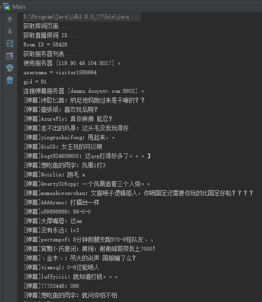

# DouYu Danmaku

捕获斗鱼弹幕的 Java 程序，借此项目，学习 Netty 。

## 使用方式

```bash
java -jar DouYuDanmaku.jar {$URL} {$flag}
```

- {$URL} ：斗鱼直播间的 URL 地址
- {$flag} ：是否开启海量弹幕模式，默认为关闭。`1` 和 `true` 表示开启海量弹幕模式。对于观众人数少的直播间，需要开启海量弹幕模式。

默认的，应用程序会输出目标直播间的弹幕信息、赠送的礼物信息、管理员操作信息、土豪进入房间信息。

例如，yyf 的斗鱼直播间的 URL 是 [http://www.douyu.com/58428](http://www.douyu.com/58428) ，执行以下命令，可以查看 yyf 斗鱼直播间的弹幕信息。

```bash
java -jar DouYuDanmaku.jar http://www.douyu.com/58428
```

效果如下：



## 感谢

本项目，阅读和借鉴的很多其他人的成果，尤其是 [brucezz](https://github.com/brucezz) 关于抓取斗鱼弹幕内容的文章，以及抓取斗鱼弹幕的 Java 应用程序 [DouyuCrawler](https://github.com/brucezz/DouyuCrawler) 。

## 其他

关于斗鱼弹幕抓取的方式，可以参照一下内容：

- [抓取斗鱼直播弹幕 - Brucezz's Blog](http://brucezz.github.io/articles/2016/01/11/douyu-crawler/)
- [斗鱼 Socket 信息类型 1](message_type_1.md)
- [斗鱼 Socket 信息类型 2](message_type_2.md)


## 2018-06-15
斗鱼变更了socket中报文数据，我在fork后，更新了新的正则规则，功能正常使用。
之所以fork这个项目，最初是因为最近一直在学习socket，对netty这块很感兴趣。昨天闲看到几个socket抓取弹幕的项目，感觉只是demo级别的，不适用于实际开发。
故今天找到这个基于netty的，感觉还可以。后续学习扩展一下自己想加的功能。
